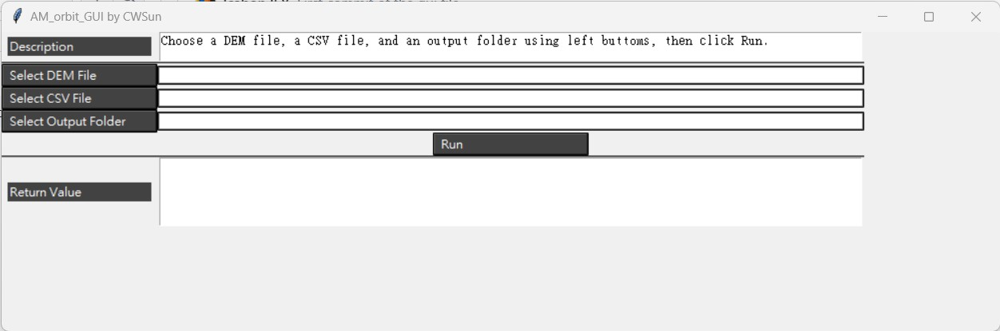

# AM_Orbit_GUI 說明
本文說明如何使用 AM_Orbit_GUI。  

## 視窗預覽  


## 使用方式  
1. 選擇 DEM 路徑。
1. 選擇任務路徑。
1. 選擇輸出資料夾（視主程式需要調整）。
1. 按 run 執行，執行結果顯示在下方。

## 安裝測試用執行環境  
本程式需安裝額外的套件以顯示視窗主題。**目前版本主程式尚未完全實作，故此處指的套件不含主程式所需的套件。**    

### 建立新環境
`conda create -c conda-forge -n tkgui python `  

### 啟動環境  
`conda activate tkgui`  

### 安裝主題套件
```shell
pip install ttkthemes
```

往後執行時僅需啟動環境即可執行。  
  
## Todo  
1. 串接 LMIO 以及 MPP 至 run_function 中。  
  
圖形介面初版： [lcabon258](https://github.com/lcabon258)  